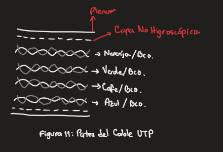

# Notas de Redes I (02/09/22)
## Medios de transmisión
También conocidos como **canales de comunicación** son un elemento fundamental en las redes. Hay dos categorías principales: *guiados* y *no  guiados*. Comenzaremos definiendo los guiados. Los guiados son aquellos que cuentan con una infraestructura física (molecular) sobre la cual se transmite información en forma electromagnética.

## Medios de transmisión guiados
Algunos tipos son:
- Cable Coaxial
- Cables UTP/STP
- Fibra Óptica

entre otros.
### **Cable coaxial**
Su estructura le ha llevado a tener una ponderación muy alta dentro de los medios de transmisión. Existe una gran gama de cables coaxiales. Los componentes del cable coaxial son:

Las matrículas de cables coaxiales que llegaron a ser utilizados en redes fueron:
- RG58A/U
- RG59
- RG6
- RG62
- RG11

> El estándar AWG se encarga de regular los calibres de los diferentes cables.

Fue el primer medio de comunicación en las redes, de ahí que su uso fuera tan abundante en la segunda mitad del siglo XX. Su uso excedido en diferentes empresas y las carentes consideraciones de su toxicidad fueron el detonante de diferentes accidentes que dieron pie a la búsqueda de otros medios de transmisión.

**BNC: British Naval Connector**, es el insumo que se requiere para trabajar con los cables coaxiales y formar así un bus de datos que pueda servir para construir una red de datos. Este tipo de redes tenía una gran serie de complicaciones para el mantenimiento físico. 
> Ningún conector debe exceder un grado de doblez de 90°

Los componentes de las puntas BNC son:

### **Cable UTP/STP**
Se compone de 8 pares de hilos de cobre estañado de calibre 22 y 24 AWG. Se identifican por 4 colores con su respectivo par bicolor con blanco. Los cables vienen trenzados para impedir interferencia electromagnética.
- Naranja/Blanco
- Verde/Blanco
- Cafe/Blanco
- Azul/Blanco

Los 8 hilos se encuentran cubiertos por un forro de un material conocido *Plenum*, que ofrece resistencia a la combustión y no genera humo. Algunos cables UTP poseen además una capa *no higroscópica*. Los conectores que utiliza este medio de transmisión son los **RJ45**, en su versión macho conocidos como **Plug** y en hembra como **Jack**. Los puertos (1,2) son para transmisión, y los puertos (3,6) son para recepción. 

> El modelo electrónico de una antena es un capacitor
